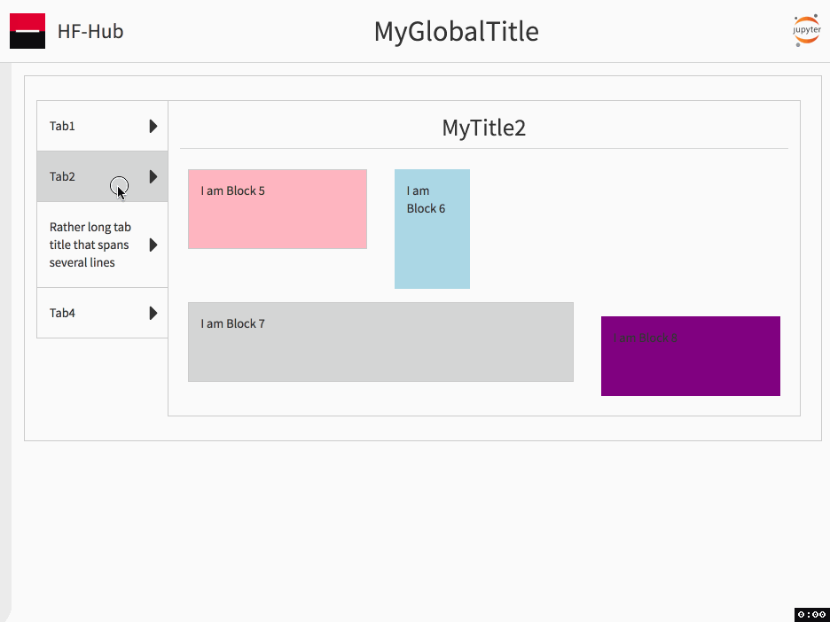

# ezdashboard

## 1 - Overview

**ezdashboard** stands for easy dashboard.  
The purpose of this module is to enable fast creation of good looking dashboards from several raw HTML contents.  

+ Each tile contains and display an HTML+JS+CSS content
+ [Git Flavored Markdown](https://github.github.com/gfm/), including [Latex](http://www.codecogs.com/latex/eqneditor.php), content is converted to HTML
+ **IMPORTANT**: The HTML and JS must be written so as to avoid collision inter-tiles
    + No scope is added by this module
    + Content is pasted as-is (except Markdown and Latex)
+ In this demo some tile contents are just some text and a background color - but could be anything.  
+ The content can be created in any way but for a Python user I recommend:
    + *[matplotlib](https://matplotlib.org/)* for static graphs of artitrary complexity. See the [gallery](https://matplotlib.org/gallery.html) for inspiration
    + *[seaborn](https://seaborn.pydata.org/)*. See the [gallery](https://seaborn.pydata.org/examples/index.html) for information
    + *[ezhc](https://github.com/oscar6echo/ezhc)* (thin wrapper around [highcharts](https://www.highcharts.com/demo)) for 2D graphs
    + *[ezvis3d](https://github.com/oscar6echo/ezvis3d)* (thin wrapper around [visjs/graph3d](http://visjs.org/graph3d_examples.html)) for 3D graphs
    + *[toyplot/tables](https://toyplot.readthedocs.io/en/stable/table-coordinates.html)* for tables
    + *[markdown on line editor](https://jbt.github.io/markdown-editor/)* for markdown content - also Jupyter notebook [markdown cells](http://jupyter-notebook.readthedocs.io/en/latest/examples/Notebook/Working%20With%20Markdown%20Cells.html) to some extent


## 2 - Install

From command line:
````
pip install ezdashboard
````

## 3 - Examples

Below are animated gifs of 2 examples.  

### 3.1 - Bootstrap layout and Markdown support

The user has transparent accesss to a bootstrap layout.  
Blocks tagged as markdown are converted to html via the module [py-gfm](https://github.com/zopieux/py-gfm).  
The toggle button is for demo only.  


*Mouse and keyboard navigation across tabs*

### 3.2 - Various contents mixed

The user can put together various types of content and make a dashboard out of them.  


*Mouse and keyboard navigation across tabs*


## 4 - Notebooks

Read the userguide and run a demo in the [first demo notebook](http://nbviewer.jupyter.org/urls/gitlab.com/oscar6echo/ezdashboard/raw/master/demo_ezdashboard_1.ipynb).  

To look at the html/css/js generated open the [demo dashboard](https://gitlab.com/oscar6echo/ezdashboard/blob/master/sample/index_sample.html) produced (standalone HTML file) in your browser - similar to the first example animated gif above.


Then have a look at the [second demo notebook](http://nbviewer.jupyter.org/urls/gitlab.com/oscar6echo/ezdashboard/raw/master/demo_ezdashboard_2.ipynb) which uses the contents created in these notebooks:
+ [demo_create_content_graph_highchart](http://nbviewer.jupyter.org/urls/gitlab.com/oscar6echo/ezdashboard/raw/master/demo_create_content_graph_highchart.ipynb)
+ [demo_create_content_graph_visjs](http://nbviewer.jupyter.org/urls/gitlab.com/oscar6echo/ezdashboard/raw/master/demo_create_content_graph_visjs.ipynb)
+ [demo_create_content_ipyaggrid](http://nbviewer.jupyter.org/urls/gitlab.com/oscar6echo/ezdashboard/raw/master/demo_create_content_ipyaggrid.ipynb)
+ [demo_create_content_markdown_1](http://nbviewer.jupyter.org/urls/gitlab.com/oscar6echo/ezdashboard/raw/master/demo_create_content_markdown_1.ipynb)
+ [demo_create_content_markdown_2](http://nbviewer.jupyter.org/urls/gitlab.com/oscar6echo/ezdashboard/raw/master/demo_create_content_markdown_2.ipynb)
+ [demo_create_content_toyplot_tables](http://nbviewer.jupyter.org/urls/gitlab.com/oscar6echo/ezdashboard/raw/master/demo_create_content_toyplot_tables.ipynb)


<!-- pandoc --from=markdown --to=rst --output=README.rst README.md -->
